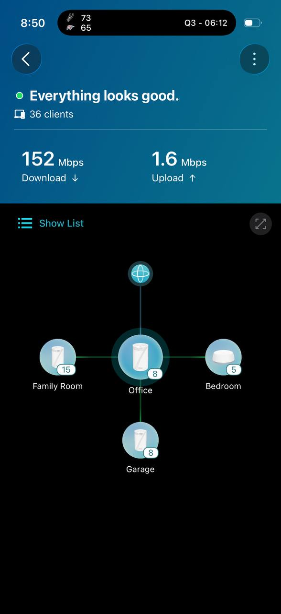
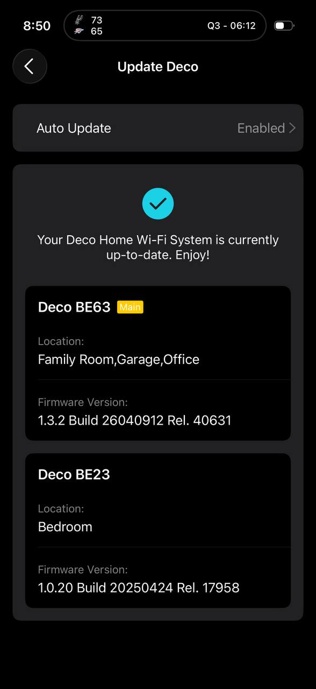
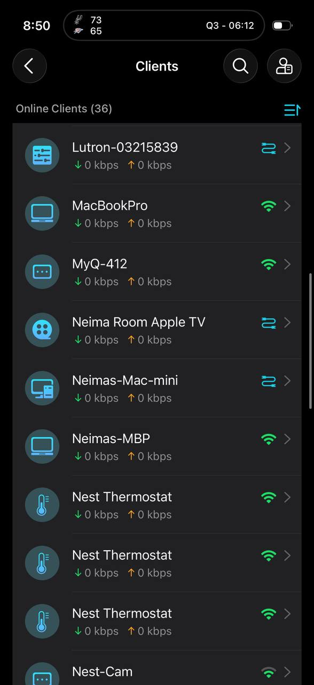
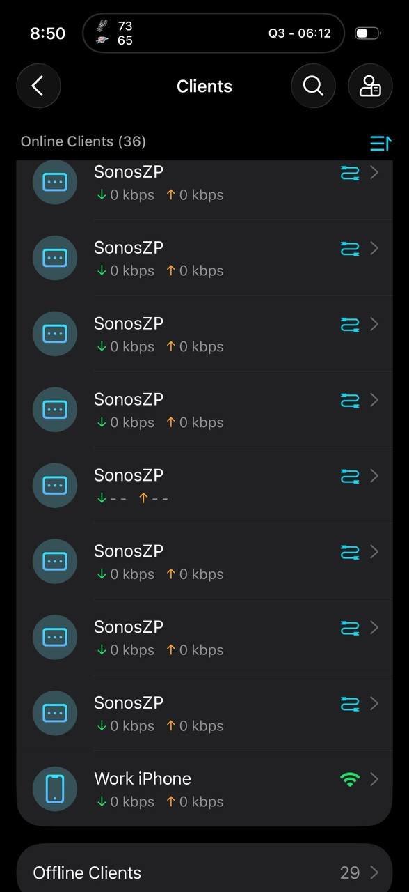
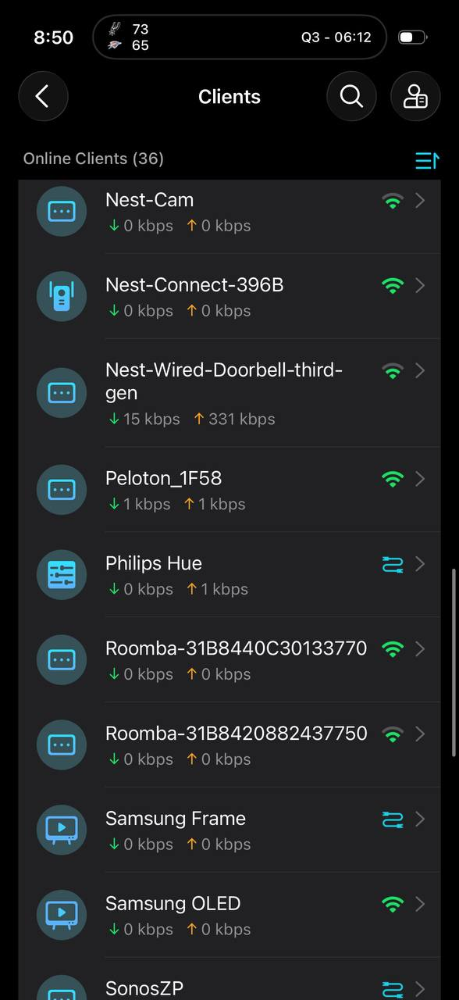
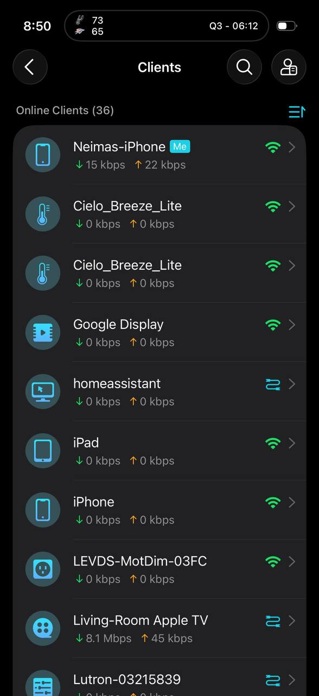

# Network Topology and Information

**Owner:** Neima  
**Created:** 2026-05-30 20:58 CDT  
**Last updated:** 2026-06-01
**Source:** Telegram discussion with Hermes/Ned + screenshots from the TP-Link Deco app

This document captures the current known state of Neima's home network, including WAN service, gateway/mesh/switch topology, TP-Link Deco app observations, and the working recommendation for future network architecture.

---

## Executive Summary

Neima's internet service and physical topology are already strong. The key architectural question is not raw bandwidth; it is whether the TP-Link Deco BE63 should remain the primary router/firewall/security brain of the home network.

**Current recommendation:**

- Keep the AT&T fiber gateway's Wi-Fi radios disabled.
- Add a dedicated gateway/router between the AT&T gateway and the Deco/switching layer.
- Move the Deco mesh into **Access Point mode**.
- Let the dedicated gateway handle DHCP, DNS, firewalling, VPN, monitoring, and future segmentation.
- Later, consider replacing the Deco APs with UniFi APs if VLAN-per-SSID segmentation becomes important.

---

## WAN / Internet Service

- ISP: **AT&T Fiber**
- Service tier: **1 Gbps symmetrical fiber**
- Typical hardwired latency: approximately **1 ms ping**
- Assessment: **More than sufficient** for the expected home lab, Hermes, Home Assistant, Tailscale/VPN, local AI infrastructure, media, backups, and smart-home use cases.

The bottleneck is not expected to be WAN bandwidth. Future limits are more likely to come from:

- Router/firewall throughput, especially with IDS/IPS or heavy inspection enabled.
- Wi-Fi performance and client capabilities.
- Internal LAN speed for local NAS/server/workstation workflows.
- VLAN and segmentation capabilities of the wireless AP layer.

---

## Current Physical Topology

Neima described the current network as follows:

```text
AT&T fiber gateway / fiber box
  - Model: BGW320-500
  - Wi-Fi radio broadcast turned off
  - Configured in bridge mode / passthrough-style mode
  - Uses multi-gig port for LAN handoff
        ↓
TP-Link Deco BE63 main node
  - Connected through its 2.5 GbE port
  - Currently acts as the main router/gateway for the home network
        ↓
2.5 GbE 8-port switch
  - Feeds the other TP-Link Deco mesh/access point nodes
  - Feeds downstream switching
        ↓
Additional TP-Link Deco nodes
  - Three additional Deco access points/nodes mentioned
  - Mesh appears to be using wired backhaul or at least wired-distributed topology
        ↓
Luxul 16-port gigabit switch
  - Feeds the rest of the home's Ethernet ports
        ↓
Home Ethernet drops / wired clients
```

Condensed version:

```text
AT&T Fiber Gateway
  → Main Deco BE63
    → 2.5 GbE 8-port switch
      → Deco BE63/BE23 nodes
      → Luxul 16-port gigabit switch
        → house Ethernet ports
```

---

## Known Network Hardware

### ISP / WAN

- **AT&T Fiber gateway — BGW320-500**
  - Wi-Fi radios disabled.
  - Multi-gig Ethernet handoff in use.
  - User describes it as bridge mode. Practical note: many AT&T residential gateways use IP Passthrough rather than pure bridge mode, but the intended behavior is the same: demote the AT&T box and let the downstream router control the LAN.

### Wi-Fi / Mesh

- **TP-Link Deco BE63 mesh**
  - Three BE63 nodes mentioned.
  - One BE63 appears to be the main/router node.
  - Main BE63 connects to AT&T fiber gateway over 2.5 GbE.

- **TP-Link Deco BE23**
  - One BE23 node mentioned.
  - Appears in the Deco firmware screenshot as the `Bedroom` node.

### Switching

- **2.5 GbE 8-port switch**
  - Core/distribution switch immediately downstream of the main Deco BE63.
  - Feeds other Deco nodes and downstream switching.

- **Luxul 16-port gigabit switch**
  - Feeds the rest of the home's Ethernet ports.
  - Gigabit switching layer for wired home drops.

### Mac Mini LAN / Home Assistant Bridge State

- **Mac Mini active LAN interface:** `en9`
  - Adapter: UGREEN USB-C 2.5GbE Ethernet adapter.
  - MAC address: `6c:1f:f7:c0:3e:e5`.
  - Router reservation / canonical LAN IP: `192.168.68.85`.
  - Verified link: `2500Base-T <full-duplex>`.
  - Hostname/mDNS: `Neimas-Mac-mini.local` resolves to `192.168.68.85`.
- **Important recovery note:** do not assume the old built-in Ethernet interface `en0` is the active server LAN path. Future scripts, docs, UTM bridge settings, and SSH assumptions should use `en9` unless the physical adapter changes again.
- **Home Assistant UTM bridge:** HAOS VM is named `Linux` and must bridge to `en9`, not stale `en0`, after the UGREEN adapter migration.
- **Home Assistant reachability verified after adapter migration:**
  - `http://192.168.68.68:8123/` returned HTTP 200.
  - `http://homeassistant.local:8123/` returned HTTP 200.

---

## Current Deco App Observations

The Deco app screenshots show a non-trivial smart-home network with many active clients.

### Network Health / Topology

From the Deco topology/status screenshot:

- Status: **Everything looks good**
- Online clients: **36**
- Current observed usage at screenshot time:
  - Download: **152 Mbps**
  - Upload: **1.6 Mbps**
- Visible Deco node/client distribution:
  - **Family Room:** 15 clients
  - **Office:** 8 clients
  - **Bedroom:** 5 clients
  - **Garage:** 8 clients

The topology screen shows the Internet uplink feeding the central/main node labeled **Office**, then additional nodes labeled **Family Room**, **Bedroom**, and **Garage**.



---

### Firmware / Update Status

From the Deco firmware/update screenshot:

- Auto Update: **Enabled**
- Status: **Your Deco Home Wi-Fi System is currently up-to-date**

Visible firmware entries:

- **Deco BE63**
  - Marked as: **Main**
  - Locations shown: `Family Room, Garage, Office`
  - Firmware: `1.3.2 Build 26040912 Rel. 40631`

- **Deco BE23**
  - Location shown: `Bedroom`
  - Firmware: `1.0.20 Build 20250424 Rel. 17958`

Note: the BE63 card appears to group multiple BE63 units under one firmware entry rather than listing each BE63 separately.



---

## Client Inventory Observed in Screenshots

The screenshots show **36 online clients** and at least **29 offline clients** in the Deco app.

The Deco client list explicitly marks visible devices as either wired/Ethernet or Wi-Fi. This should be treated as a **point-in-time observation from the screenshots**, not a permanent guarantee, because some devices may later roam, reconnect, or use a different interface.

### Visible Wired / Ethernet Clients

These devices are shown with the Deco wired/Ethernet icon:

#### Infrastructure / Smart Home Bridges

- `homeassistant` — wired/Ethernet, no active throughput shown.
- `Philips Hue` — wired/Ethernet, approximately `0 kbps` down / `1 kbps` up in the screenshot.
- `Lutron-03215839` — wired/Ethernet, `0 kbps` down / `0 kbps` up in visible rows.

#### Computers / Servers

- `Neimas-Mac-mini` — wired/Ethernet, no active throughput shown.

#### Media / Entertainment

- `Living-Room Apple TV` — wired/Ethernet, active throughput visible around `8.1 Mbps` down / `45 kbps` up.
- `Neima Room Apple TV` — wired/Ethernet, `0 kbps` down / `0 kbps` up in the screenshot.
- `Samsung Frame` — wired/Ethernet, `0 kbps` down / `0 kbps` up in the screenshot.
- Multiple `SonosZP` entries — wired/Ethernet. The screenshots show at least nine visible `SonosZP` rows marked wired, most at `0 kbps` down / `0 kbps` up; one row shows no current throughput value (`--`).

### Visible Wi-Fi / Wireless Clients

These devices are shown with the Deco Wi-Fi icon:

#### Personal / Apple / Computers

- `Neimas-iPhone` — Wi-Fi, marked `Me`, around `15 kbps` down / `22 kbps` up in the screenshot.
- `Work iPhone` — Wi-Fi, `0 kbps` down / `0 kbps` up.
- `MacBookPro` — Wi-Fi, `0 kbps` down / `0 kbps` up.
- `Neimas-MBP` — Wi-Fi, `0 kbps` down / `0 kbps` up.
- `iPad` — Wi-Fi, `0 kbps` down / `0 kbps` up.
- `iPhone` — Wi-Fi, `0 kbps` down / `0 kbps` up.

#### Smart Home / IoT

- `LEVIDS-MotDim-03FC` — Wi-Fi, `0 kbps` down / `0 kbps` up.
- `Cielo_Breeze_Lite` — Wi-Fi, two visible entries, both `0 kbps` down / `0 kbps` up.
- `MyQ-412` — Wi-Fi, `0 kbps` down / `0 kbps` up.

#### Nest / Google

- `Nest Thermostat` — Wi-Fi, multiple visible entries, each `0 kbps` down / `0 kbps` up.
- `Nest-Cam` — Wi-Fi, `0 kbps` down / `0 kbps` up in the visible row.
- `Nest-Connect-396B` — Wi-Fi, `0 kbps` down / `0 kbps` up.
- `Nest-Wired-Doorbell-third-gen` — Wi-Fi, around `15 kbps` down / `331 kbps` up in the screenshot. Despite the product name including "Wired," Deco shows it connected wirelessly.
- `Google Display` — Wi-Fi, `0 kbps` down / `0 kbps` up.

#### Media / Fitness / Appliances

- `Samsung OLED` — Wi-Fi, `0 kbps` down / `0 kbps` up.
- `Peloton_1F58` — Wi-Fi, around `1 kbps` down / `1 kbps` up.
- `Roomba-31B8440C30133770` — Wi-Fi, `0 kbps` down / `0 kbps` up.
- `Roomba-31B8420882437750` — Wi-Fi, `0 kbps` down / `0 kbps` up.

### Inventory Takeaways for Network Planning

- The important home automation bridges — **Home Assistant, Philips Hue, and Lutron** — appear to be wired. That is good for reliability and future segmentation.
- Core media devices are mixed: Apple TVs and the Samsung Frame appear wired, while the Samsung OLED is Wi-Fi.
- Sonos appears heavily wired in the screenshots, which can be beneficial, but Sonos can be sensitive to network topology, STP, multicast, and VLAN boundaries. This matters if future segmentation is added.
- Nest, MyQ, Cielo, Roomba, Peloton, and several personal/mobile devices are Wi-Fi. These are natural candidates for an IoT or less-trusted wireless segment later, if the AP layer supports VLAN-backed SSIDs.
- The Nest wired doorbell is electrically wired for power, but it is still a Wi-Fi network client according to Deco.

### Screenshot References

The Deco client list screenshot below shows several wired and Wi-Fi clients including Lutron, MacBook/Mac mini, MyQ, Apple TV, Nest thermostat entries, and Nest camera devices.



The screenshots below show additional clients including Sonos, Nest, Hue, Roomba, Samsung displays, Neima's iPhone, Home Assistant, and other smart-home endpoints.







---

## Security / Architecture Assessment

The current topology is physically sensible and already better than a default ISP-router-only setup:

- AT&T gateway Wi-Fi is disabled.
- Main networking is handed off to the Deco system.
- Deco mesh nodes appear to have wired distribution/backhaul support.
- There is a 2.5 GbE distribution layer before the gigabit access switch.

The main weakness is architectural, not performance-related:

> The main Deco BE63 is still the primary router/firewall/DHCP/security brain of the home.

That means TP-Link/Deco is currently responsible for:

- Routing
- NAT
- DHCP
- Firewall behavior
- Port forwarding behavior
- Some client policy/security features
- Overall LAN control plane

Given the number of IoT and smart-home devices visible in the network, it would be cleaner long-term to move routing and policy enforcement to a more dedicated gateway platform.

---

## Recommended Target Architecture

Recommended next architecture:

```text
AT&T Fiber Gateway
  - Wi-Fi radios off
  - IP Passthrough / bridge-like mode
        ↓
Dedicated Gateway / Router
  - UniFi Cloud Gateway Max, UDM SE/Pro/Pro Max, Firewalla, or Protectli/pfSense/OPNsense
  - Handles DHCP, DNS, firewall, VPN, monitoring, and segmentation
        ↓
2.5 GbE switch
        ↓
Deco BE63/BE23 nodes in Access Point mode
        ↓
Luxul 16-port gigabit switch / home Ethernet ports
```

Practical phased recommendation:

1. **Do not panic-replace the Deco system.** It is performing well as Wi-Fi/mesh hardware.
2. **Add a dedicated gateway/router** between the AT&T gateway and the 2.5 GbE switch/Deco layer.
3. **Move Deco to Access Point mode** so it no longer routes/NATs/firewalls the home network.
4. **Move DHCP, DNS, firewall, VPN, and reservations** to the dedicated gateway.
5. **Later consider UniFi APs** if strong VLAN-per-SSID segmentation becomes important.

---

## Gateway Options Discussed

### UniFi Cloud Gateway Max

Good fit if Neima wants:

- Compact form factor.
- 2.5 GbE-oriented gateway.
- UniFi Network controller built in.
- A clean path toward future UniFi APs.
- Better visibility/control than Deco routing.

### UniFi Dream Machine SE / Pro / Pro Max

Good fit if Neima wants:

- Rack-style network core.
- More expandability.
- Possible future UniFi Protect/camera integration.
- Bigger homelab-style architecture.

### Agent / Skill Reality Check for UniFi Programming

Neima found a `unifi-cli` skill/file hoping Hermes could program a future UDM directly. That file is not enough by itself.

What it appears useful for:

- installing a community `unifi` CLI
- connecting to a local UniFi controller with a local admin account
- listing sites, devices, clients, and health
- basic inventory/export work after controller access exists

What it does **not** solve:

- safe UDM cutover from AT&T BGW320-500 + Deco routing
- DHCP/reservation migration
- VLAN/network design
- firewall policy design
- mDNS/SSDP/Sonos/AirPlay/Home Assistant exceptions
- rollback planning
- direct unattended programming without controller/API/browser access

Working assumption: Hermes can help program UniFi only after local UniFi controller access exists through browser/UI, API, or a verified CLI. Treat generic UniFi CLI skills as inventory helpers, not the actual migration plan.

### Firewalla Gold Plus / Gold Pro

Good fit if Neima wants:

- Security-first interface.
- Strong device visibility and family/device controls.
- Good alerting.
- Less full-stack UniFi commitment.

### Protectli / pfSense / OPNsense

Good fit if Neima wants:

- Maximum control.
- Open firewall platform.
- More hands-on network administration.

Less ideal if the goal is a polished, low-friction home infrastructure experience.

---

## VLAN / Segmentation Notes

A dedicated gateway can create VLANs such as:

- Trusted LAN
- IoT LAN
- Guest LAN
- Camera LAN
- Server/Lab LAN
- Home Assistant / automation management zone

However, if the Deco mesh remains the AP layer, VLAN-per-SSID support may be limited. That is the main caveat of keeping Deco long-term.

With Deco APs, the upgrade still gives:

- Better router/firewall/DNS/VPN control.
- Better visibility.
- Reduced trust in Deco as the routing/security authority.
- A cleaner future migration path.

But full enterprise-style Wi-Fi segmentation likely requires APs that support SSID-to-VLAN mapping, such as UniFi APs.

---

## Working Decision

Current best path:

```text
Phase 1: Keep Deco as Wi-Fi, demote it to AP mode, add a real gateway.
Phase 2: Use the new gateway for DHCP/DNS/firewall/VPN/monitoring.
Phase 3: Replace Deco APs with UniFi or other VLAN-capable APs only if segmentation needs justify it.
```

The network does **not** need a WAN bandwidth upgrade before this work. The existing 1 Gbps symmetrical fiber service is already a strong foundation.

---

## Open Questions / Future Discovery

Items to verify before a gateway migration:

- Exact AT&T gateway model. ✅ BGW320-500
- Whether current mode is true bridge mode or AT&T IP Passthrough.
- Exact model of the 2.5 GbE 8-port switch.
- Exact model of the Luxul 16-port gigabit switch.
- Whether either switch supports managed VLANs.
- Whether the Deco BE63/BE23 system supports VLAN tagging or SSID-to-VLAN mapping in Access Point mode.
- Whether all Deco nodes are using wired Ethernet backhaul.
- Whether Home Assistant currently has a static IP or DHCP reservation.
- Whether Nest, Lutron, Hue, MyQ, Sonos, and Apple TV devices require any local multicast/mDNS handling after segmentation.

---

## Source Images

All images from the Telegram conversation were copied into this repository at:

```text
references/assets/network-topology/
```

Files:

- `deco-topology-health.jpg`
- `deco-firmware-update-status.jpg`
- `deco-clients-network-devices.jpg`
- `deco-clients-sonos-work-iphone.jpg`
- `deco-clients-iot-media.jpg`
- `deco-clients-personal-homeassistant.jpg`
